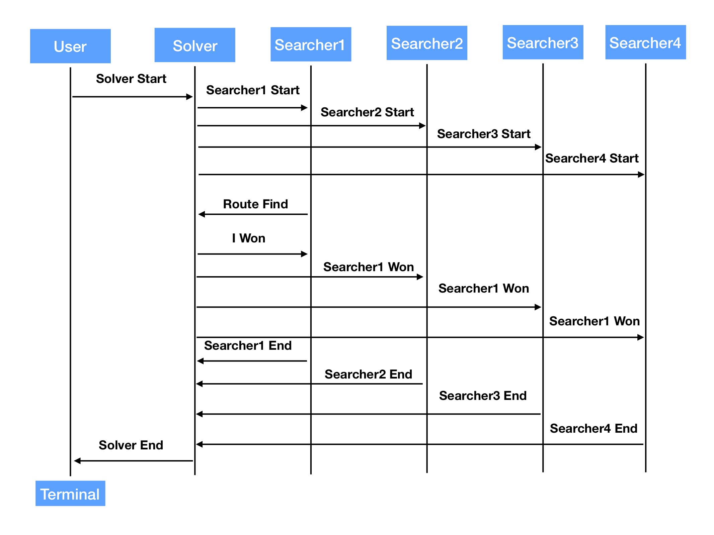

# Akka - Traveling Salesman Problem
## Introduction
* Use Akka to demo a small system for solving TSP
* 1 solver assign this task to 4 searchers
* When one searcher has the answer which can satisfy the requirement, it tells the solver. Then, all other searchers stop working and the searcher is declared as winner. If no answer can satisfy the requirement, all searchers fail. After that, the solver terminate the system.
* Use Greedy Algorithm to solve TSP
## Akka Actions

## Traveling Salesman Problem - Greedy Algorithm
1. Find minimum path of all paths and add it to route.
2. If it can be added, add next minimum path to route. 
3. If it cannot, move to next minimum path and repeat. 
4. Finally, build the circle.
## Reference
* [Akka 2.4](https://doc.akka.io/docs/akka/2.4/java.html#java-api)
* Download from [here](https://doc.akka.io/downloads/) (version: akka_2.11-2.4.20)
* Use lib
  > akka-2.4.20/lib/scala-library-2.11.11.jar .  
  > akka-2.4.20/lib/akka/akka-actor_2.11-2.4.20.jar .  
  > akka-2.4.20/lib/akka/config-1.3.0.jar .  
